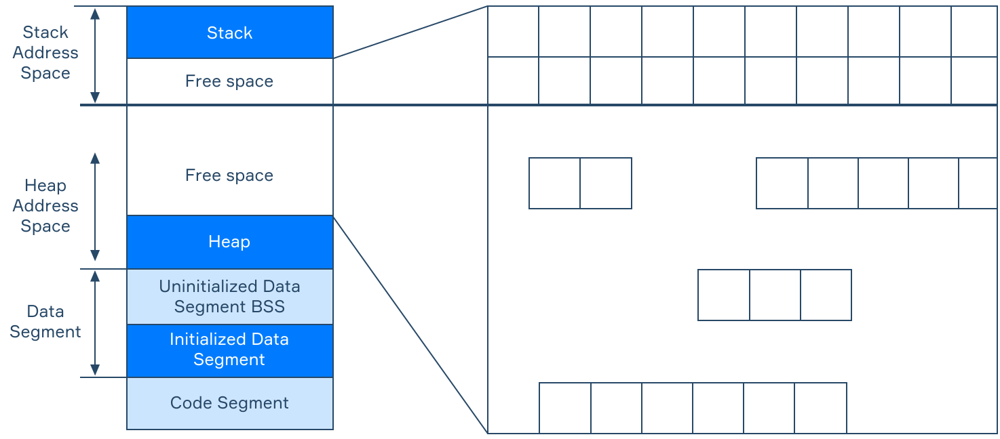
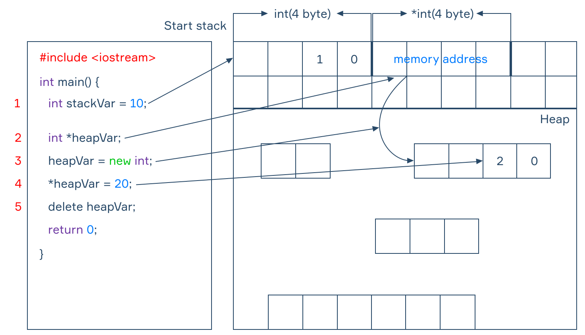

# Dynamic memory

Image source: https://hyperskill.org/learn/step/37761
## Memory segments
- Code segment (aka text segment)
  - Stores (binary) compiled program
- Data segment
  - Initialized data segment
    - Stores global, static, and const data
  - Uninitialized data segment
    - Stores the same, but if uninitialized / zero
- Stack segment
  - LIFO
  - Stores local variables
  - Organized, sequential
  - Grows downwards
  - "Call stack"
    - Part of stack where fn calls are tracke
- Heap segment
  - Where dynamic memory allocation occurs
  - Not automatically managed (new, delete)
  - Dispersed, scattered
  - Grows upwards

## Stack and heap example

Image source: https://hyperskill.org/learn/step/37761

## Memory allocation
Types:
- Static memory 
  - Known & allocated at compile time
  - Data (aka static) segment
  - Eg global, static variables
- Automatic memory
  - Known at compile time
  - Allocated, deallocated during runtime 
  - Stack
  - Eg local variables
- Dynamic
  - Allocated at runtime, managed manually by the programmer
  - Heap
  - Risk of memory leaks
  - Eg. memory allocated via `new`

## Dynamic arrays
Uses:
- Dynamic - good if num elements not known at compile time, or will change.
- Resizable - can grow/ shrink
- Good for large datasets - can handle lots of data
- Good for complex datasets - eg many big user defined objects

## Stack vs heap best practices
- Stack for:
  - Not-too-big objs with lifetime in a single function.
- Heap for:
  - Big objs
  - Groups (eg vectors, arrays) that may change size during runtime
  - Objs with lifetime > current fn / scope