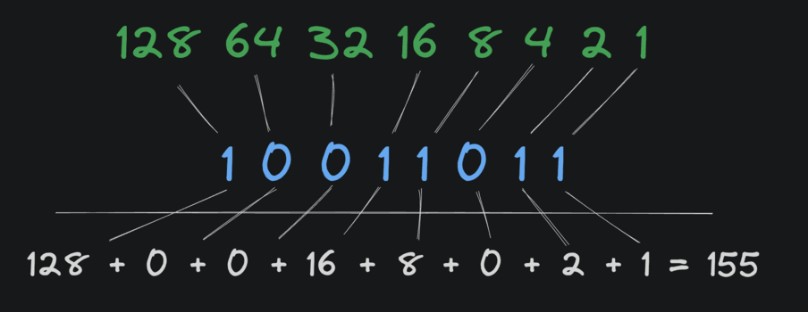

# Python

<!-- TOC -->
* [Python](#python)
  * [Design patterns](#design-patterns)
  * [Binary](#binary)
  * [Dependency injection](#dependency-injection)
  * [Interface vs Base class](#interface-vs-base-class)
  * [The Zen of Python, by Tim Peters](#the-zen-of-python-by-tim-peters)
<!-- TOC -->

## Design patterns
Reference: Head First Design Patterns, by Eric and Elisabeth Freeman

## Binary
Binary numbers have a 1s place, 2s place, 4s place, 8s place, etc

Image from Boot.Dev programming course

## Dependency injection
Reference: https://hyperskill.org/learn/step/20580 

## Interface vs Base class
- Interface for specifying a contract
- Base class for providing resuable behaviour

## The Zen of Python, by Tim Peters
Beautiful is better than ugly.

Explicit is better than implicit.

Simple is better than complex.

Complex is better than complicated.

Flat is better than nested.

Sparse is better than dense.

Readability counts.

Special cases aren't special enough to break the rules.

Although practicality beats purity.

Errors should never pass silently.

Unless explicitly silenced.

In the face of ambiguity, refuse the temptation to guess.

There should be one-- and preferably only one --obvious way to do it.

Although that way may not be obvious at first unless you're Dutch.

Now is better than never.

Although never is often better than right now.

If the implementation is hard to explain, it's a bad idea.

If the implementation is easy to explain, it may be a good idea.

Namespaces are one honking great idea -- let's do more of those!

\- https://peps.python.org/pep-0020/
