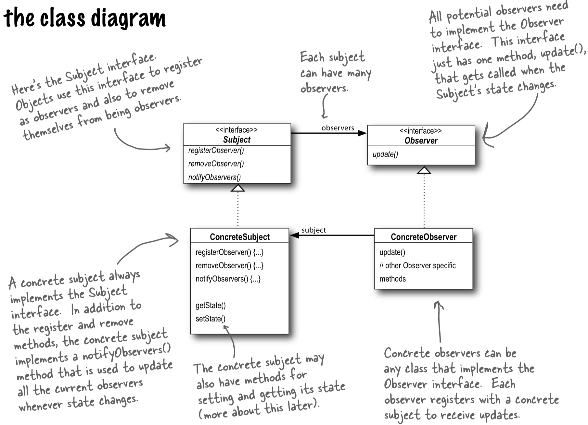

<!-- TOC -->
  * [Checklist](#checklist)
    * [Concepts ("what" we're aiming for)](#concepts-what-were-aiming-for)
    * [Principles ("how" we'll achieve it)](#principles-how-well-achieve-it)
  * [Observer pattern](#observer-pattern)
    * [Usage notes](#usage-notes)
    * [Throwback to principles](#throwback-to-principles)
  * [Strategy pattern](#strategy-pattern)
    * [Usage notes](#usage-notes-1)
    * [Throwback to principles](#throwback-to-principles-1)
<!-- TOC -->

## Checklist
Things to double-check before submitting code, based on common mistakes:

### Concepts ("what" we're aiming for)
- DRY: 
  - what is repeated?
- YAGNI: 
  - what isn't being used (yet)?
- SRP: 
  - what might cause this component to change? if >1 reasons, then the responsibility isn't single, is it.
- Open/closed: 
  - when someone adds to this, will they modify existing code?
- Decoupled? 
  - are different concepts/responsibilities mixed together in classes/methods?
- Runtime flexibility: 
  - able to change in main fn?
- OOP: 
  - sensible reflection of real world concepts?

### Principles ("how" we'll achieve it)
- What varies?
  - Separated things that vary from what stays the same
- Interfaces vs implementation:
  - Describe "what it does" (behaviour) not "how it does it" (implementation)
    - Supports decoupling and open/closed principle
- Composition vs inheritance:
  - "has a" where possible (composition); use "is a" (inheritance) only when want to reuse ALL base class functionality across derived classes (and won't want to change it, eg at runtime), and there’s a clear hierarchical relationship.
    - Supports runtime flexibility & separation of concerns
    - Note: base class is considered "fragile" if it's going to need changes that'll require changes in all its inheriting classes.
- Coupling: 
  - Minimize dependencies between components by using abstractions (like interfaces) and ensuring changes in one component have minimal impact on others.
    - Supports flexibility, maintainability, and testability.
- DI: are dependencies visible/test-friendly (constructor), temp/short-lived (method), or optional/cyclic (setter)
  - Supports decoupling and testability

## Observer pattern
For notifying many dependents when observed object changes state, so they can update automatically.
- Push when all observers need the same data in the same format. Simpler for observers.
- Pull when observers have different data requirements. Simpler for subject.

Images from Head First Design Patterns

### Usage notes
Use if you need:
- Communication of state between objects...
- ...in a one-to-many way
- Loose coupling

Don't use if:
- You need a specific order of notifications for observers

### Throwback to principles
What varies?
- Subject state
- Number & type of observers

Interface vs implementation:
- Subject & observer both use interfaces

Composition vs inheritance:
- Relationship b.w subject and observers is composed at runtime, not inherited

Coupling:
- Loose coupling between subject and observers:
  - Via dynamic list of subscribers, shared notification mechanism (update())
- Notification-based:
  - Observers need to know something about the subject's state (semantic coupling)
  - There is a time element (temporal coupling)

## Strategy pattern
For encapsulating strategies (algorithms / families of "stuff") separately and having them swappable at runtime without altering client code.
- Note: "client" refers to the thing using the strategy pattern.

Image from Head First Design Patterns

### Usage notes
Use if you need:
- Clear open/closed format
- Nice separation of concerns
  - In particular: things that vary to be separate from things that stay the same
- Loose coupling: remaining coupling (client implementation of strategy) is explicit (if constructor DI is used)
- Runtime flexibility
- Reusability
- To avoid excessive if-else conditionals

Don't use if:
- You don't like how much boilerplate code it generates
- You don't need dynamic behaviour, or couple conditionals can do it for you
- Your context class (the one using the strategy) gets complex
- You need to optimize performance

### Throwback to principles
What varies?
- The strategies (the behaviour the client class "has")
- The client base class structure and behaviour

Interface vs implementation:
- Strategies use interfaces

Composition vs inheritance:
- Client class is composed of strategies (behaviours)

Coupling:
- Reduces coupling between client and strategies 
  - Via interfaces, composition, and making thing swappable
- Interface-based:
  - Client still has to manage and invoke strategies