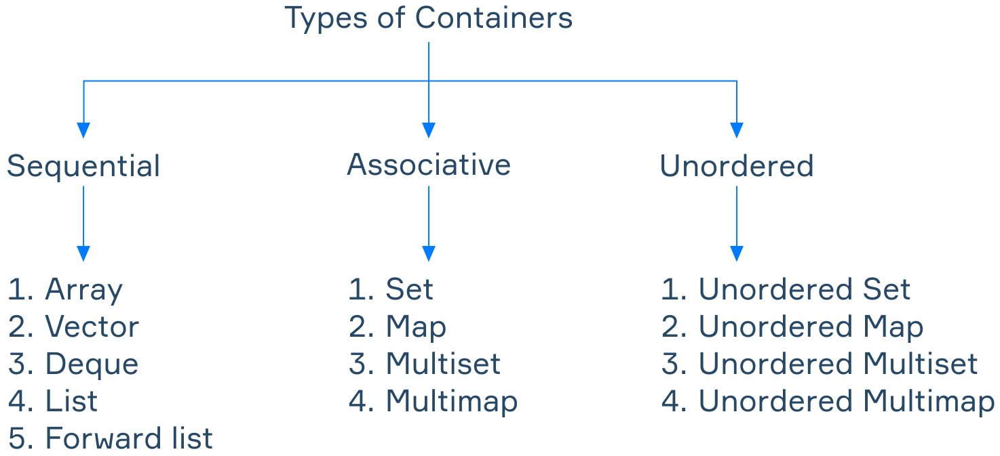
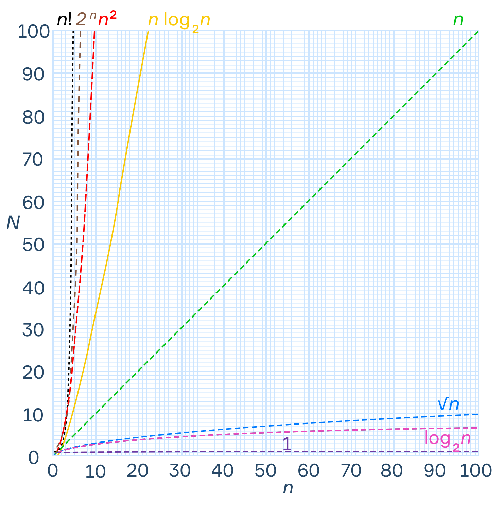
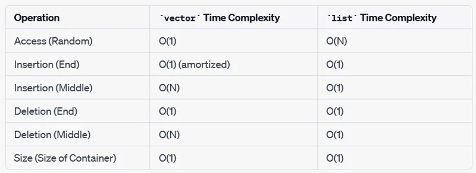

## Standard Template Library (STL)
STL is a collection of template classes and functions that provide essential data structures (containers), algorithms, and iterators

### Containers vs data structures
Containers:
- specifically designed to hold a collection of objects
- abstract the implementation details of the underlying data structure
- provide a standard interface for managing elements
  - eg: vector, list, map

Data structures:
- describe how data is organized
  - eg: array, linked list, tree, queue

Containers are specific implementations of data structures

#### Sequential containers
- Order matters
- Position based on timing of insertion
- C++ data structures of this type:
  - Vector, Deque, List, and Forward list

#### Associative containers
- Association with key matters
- Position based on value
- C++ data structures of this type:
  - Set, Multiset, Map, and Multimap

#### Unordered containers
- Aka unordered associative containers
- No particular order
- C++ data structures of this type:
  - Unordered set, unordered map, unordered multimap, and unordered multiset

#### Container adapters
- Containers made from other containers
- C++ data structures of this type:
  - Stack, queue, priority queue

### Algorithmic complexity

Fastest
- O(1) - constant - runtime (N) const regardless of input size (n)
  - eg array access by index
- O(log(n)) - logarithmic - slow growth
  - eg binary search in sorted list
- O(n) - linear - runtime directly proportional to input size
  - eg linear search in unsorted list
- O(n*log(n)) - linearithmic - runtime grows slightly faster than linear time
  - eg. merge sort, quicksort
- O(n^2) - quadratic - runtime increases quadratically
  - eg nested loops
- O(2^n) - exponential - rapid growth, inefficient!

Slowest

### Some O values

Images from Hyperskill programming course, https://hyperskill.org/learn/step/36769
